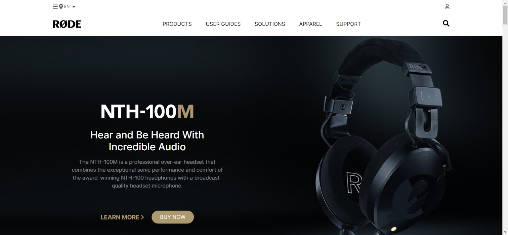

# RODE Home Page Clone

Made by **Omprasad Dornala**

## Description

This website focuses on handling various sections when placing card components and arranging elements with mobile responsive

## Built with

- Semantic HTML
- CSS
- Flexbox
- Tailwind CSS

## Key learnings

- Absolute positioning of elements.
- To apply background images.
- Create cards using flexbox
- Design footer section.

## Time taken

- This project took me more than three hours of time for Web page and three hours of time for mobile responsive.

## Deployed Version Link

- [Live Demo](https://rode-op.netlify.app/)

## Snapshot of Webpage

